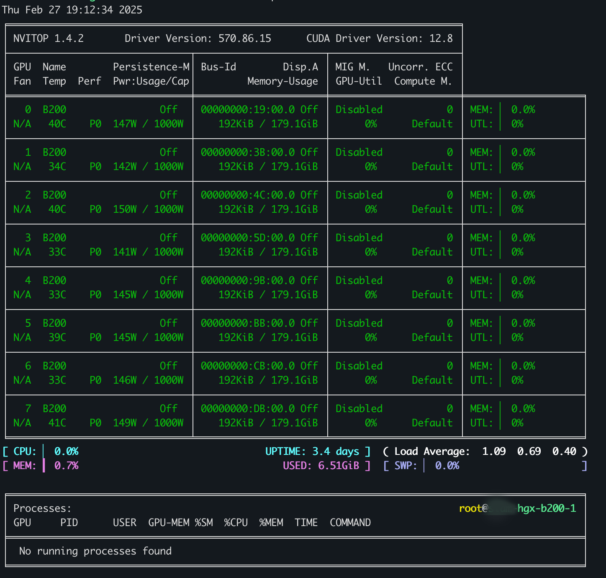

# Nvidia B200 Driver 570 Installation Guide
### System requirement  

OEM: HGX  
GPU Series: B200  
CPU: Intel  
Architecture: x86_64 or amd64  
OS: Ubuntu 22.04  
Driver version: 570.86.15  

Cuda Version: 12.8  
nvitop version: 1.4.2

Published date: 28 Feb 2025

---
Follow these instructions to install HGX B200 driver on Ubuntu 22.04  

## Prerequisites step

### Setup Nvidia keyring
```
wget -q https://developer.download.nvidia.com/compute/cuda/repos/ubuntu2204/x86_64/cuda-keyring_1.1-1_all.deb
sudo dpkg -i cuda-keyring_1.1-1_all.deb
sudo apt -y update

wget https://developer.download.nvidia.com/compute/cuda/repos/$distro/$arch/cuda-archive-keyring.gpg
sudo mv cuda-archive-keyring.gpg /usr/share/keyrings/cuda-archive-keyring.gpg

echo "deb [signed-by=/usr/share/keyrings/cuda-archive-keyring.gpg] https://developer.download.nvidia.com/compute/cuda/repos/$distro/$arch/ /" | tee /etc/apt/sources.list.d/cuda-$distro-$arch.list

sudo apt -y update
```

### Check VGA device and install ASPEED firmware 
```
lspci | grep VGA
# output here
03:00.0 VGA compatible controller: ASPEED Technology, Inc. ASPEED Graphics Family (rev 52)

If output like this then check VGA model
lspci | grep AST
02:00.0 PCI bridge: ASPEED Technology, Inc. AST1150 PCI-to-PCI Bridge (rev 06)
```
If output like this download the latest firmware version from this [link](https://www.aspeedtech.com/support_driver/?fPath=24)  
If you can’t use both wget & curl you need to download a file to your computer and use scp to send a file to your server.

```
scp downloaded-file user@host:~/somewhere
tar zxvf {downloaded-file}.tar.gz
cp Linux_DRM$version/DKMS
```

### Check kernel version
```
uname -r
# Caution make sure you choose the same version with your kernel
sudo dpkg -I ast-drm-linux$Kernel_version.deb
```
Download a binary firmware file from [link](https://drive.google.com/file/d/1rBp3z_4_LNmx8ci_U4VAL5-qB4sjM-aV/view?pli=1) provided by SMC  
Extract file and copy file to `/lib/firmware/`

```
sudo cp ast_dp501_fw.bin /lib/firmware/
```

# Installation step
---
```
sudo apt install -y nvidia-open
sudo apt install -y cuda-toolkit-12-8
sudo apt install -y cuda-drivers 
sudo apt install -y nvlsm
sudo apt install -y nvidia-fabricmanager-570
sudo apt install -y python3-pip
sudo pip3 install nvitop

# Reload package daemon, enable and start the NVIDIA Fabric Manager service
sudo systemctl daemon-reload
sudo systemctl enable nvidia-fabricmanager
sudo systemctl start nvidia-fabricmanager

```


